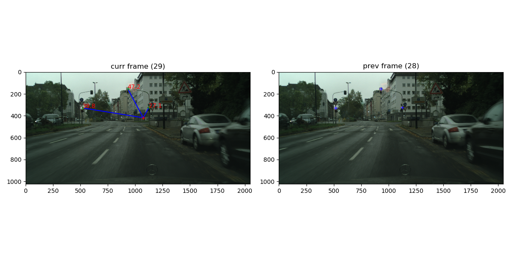

# Mobileye Project
## Traffic Lights Detection

Detecting traffic lights and the distance to them on runtime within given video.
using image processing and machine learning, Python.

a long project separated into 4 part:

#### Part 1: Detect light sources candidates
Detection of source lights in an image using convolution with customized high- and low-pass filters.

#### Part 2: Calculate candidate probability and decide if is a traffic light using neural net
creating data for the tarining using the products of the previous stage as input.
Generating and training CNN to conclude all the traffic lights in the image (using tensorflow).

#### Part 3: Find distance of the traffic lights
Estimating the distance to each detected traffic light from the camera picturing the images of interest,
involving geometric and linear algebra calculations.

#### Part 4: Integration
Integrating all previous parts into a functional and intuitive SW product.

## Running Example

## Libraries/Technologies Used
python 3.7 
numpy 
matplotlib 
jupyterlab 
opencv 
tensorflow 
PIL 
scipy

## Thanks to Mobileye mentors and Elevation stuff!!
